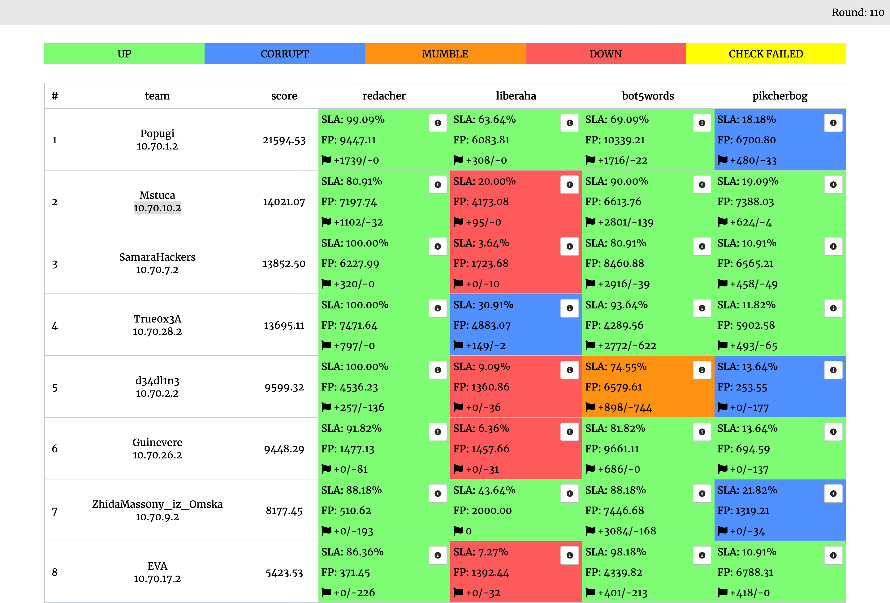

# Attack-Defence тренировка от C4T BuT S4D

Исходные коды сервисов, чекеры и сплоиты с тренировки 5 октября 2019.

## Результаты

[Полный финальный скорборд](scoreboard/full.png)

## Сервисы

| Сервис | Язык | Чекер | Сплоиты | Автор |
|--------|------|-------|---------|-------|
| **[redacher](services/redacher/)** | Python | [Чекер](checkers/redacher/) | [Сплоиты](sploits/redacher/) | [@jnovikov](https://github.com/jnovikov) |
| **[liberaha](services/liberaha/)** | PascalABC | [Чекер](checkers/liberaha/) | [Сплоиты](sploits/liberaha/) | [@alagunto](https://github.com/alagunto) |
| **[bot5words](services/bot5words/)** | Python | [Чекер](checkers/bot5words/) | [Сплоиты](sploits/bot5words/) | [@jnovikov](https://github.com/jnovikov) |
| **[pikcherbog](services/pikcherbog/)** | Golang | [Чекер](checkers/pikcherbog/) | [Сплоиты](sploits/pikcherbog/) | [@pomo_mondreganto](https://github.com/pomo-mondreganto) |

## Образ

- Ubuntu 18.04.1 LTS
- Alpine/mono in Docker

## Инфраструктура

- DevOps: author [@pomo-mondreganto](https://github.com/pomo-mondreganto), performer [@xmikasax](https://github.com/xmikasax).
- Проверяющая система: [ForcAD](https://github.com/pomo-mondreganto/ForcAD)

## Разбор
Приближается...
